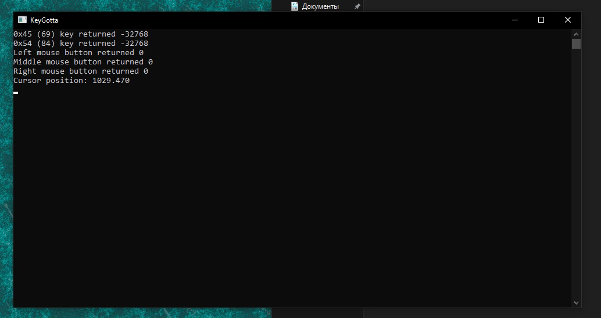

# KeyGotta

### Simple keyboard and mouse watcher for Windows

**[[English](README.md) / [Русский](README-RU.md)]**

---

**KeyGotta** is a tiny console utility for Windows. It monitors current state of keyboard and mouse using Windows API and then displays this information in console. That's all this program does.

I wrote this program in December 2021 under the name of "KamstRec", which means "Keyboard and Mouse Recorder". I have released first and the last version of the program then and have not been updating the program until August 2022, when I renamed the project to "KeyGotta" and made some fixes in code. After that the project development was stopped completely.

KeyGotta had been written in C programming language and built using TCC (Tiny C Compiler). In this edition, MinGW-w64 under Linux is used.

I have decided to release this tiny piece of shitcode into public just for fun, why not. Source code is licensed under [The Unlicense](UNLICENSE.txt), so you may do everything you wish with it.

> Mention is appreciated but not required 😉

